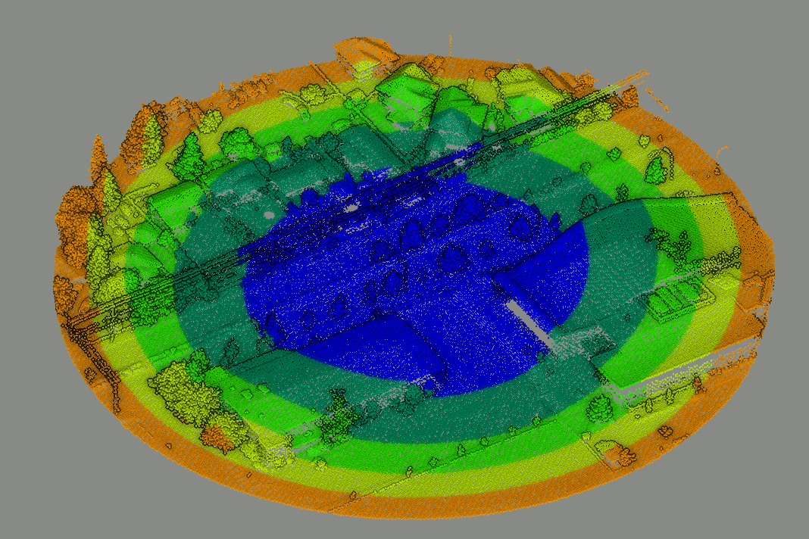
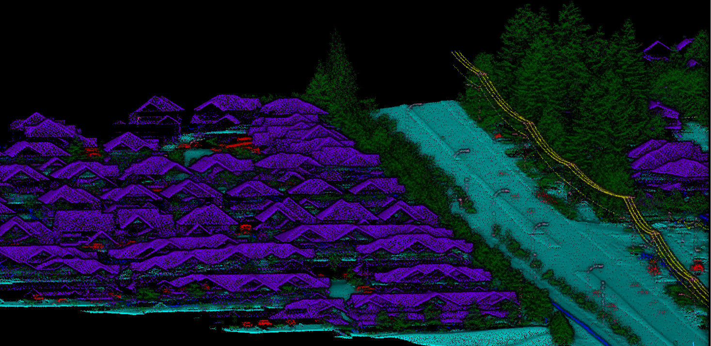

# 3D Ring Transformer for point cloud segmentation

In this project, I explore the use of the transformer architecture for 3D point cloud segmentation.
Point clouds are converted to sequential data by first acquiring a fixed number of points from a given centre
into a bubble, and then splitting this bubble of points into a sequence of 3D concentric rings. An example is shown below:

[spconv](https://github.com/traveller59/spconv) is used for ring encoding and point feature extraction.

### System specifications used during development and training of the model
- Ubuntu 20.04
- CUDA 12.0
- Python 3.8
- 16 GB NVIDIA GPU

## Quick start guide
- Install project requirements in a python 3.8.x virtual environment
- Set config at `config/config.py` [default values are set for training on the DALES dataset]
- Place your labelled point cloud data in .laz format at:
  - `data/laz-data/train-data`
  - `data/laz-data/val-data`
  - `data/laz-data/test-data`
- Run `train_data_generator.py` to generate training data. Training data will be stored at 
  - `data/bubbles/train-bubbles`
  - `data/bubbles/val-bubbles`
  - `data/bubbles/test-bubbles`
- Run `train.py` to train the model.
- Run `test.py` to test the model.

## Training on the DALES dataset
The model was trained on the [DALES](https://udayton.edu/engineering/research/centers/vision_lab/research/was_data_analysis_and_processing/dale.php) 
dataset, and model performance metrics on the test dataset (12.5% of the dataset) are provided below:

| Class | Precision | Recall | F1 score |
|-------|-----------|--------|----------|
| ground | 0.92      | 0.98   | 0.95     |
| vegetation | 0.98      | 0.93   | 0.96     |
| buildings | 0.74      | 0.82   | 0.78     |
| power_lines | 0.92      | 0.93   | 0.93     |
| vehicles | 0.67      | 0.67   | 0.67     |
| fences | 0.6       | 0.7    | 0.65     |
| poles | 0.94      | 0.96   | 0.95     |

### An example segmentation run using the model:
