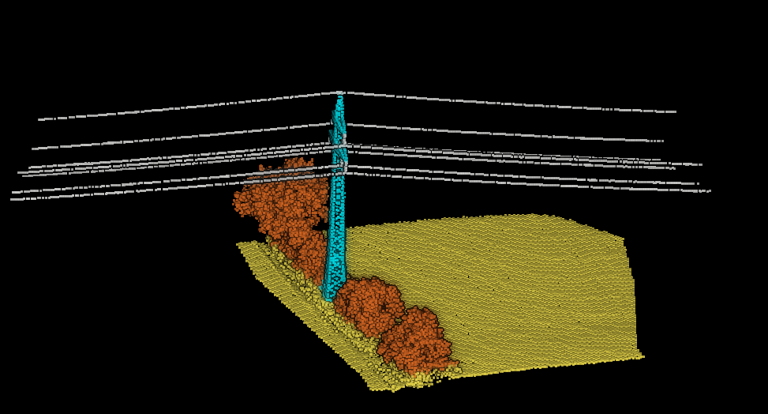

# 3D Ring Transformer for point cloud segmentation

In this project I explore the use of the transformer architecture for 3D point cloud segmentation.
Point clouds are converted to sequential data by first acquiring a fixed number of points from a given centre
into a bubble, and then splitting this bubble of points into a sequence of 3D concentric rings.

spconv is used for ring encoding and point feature extraction.

## Quick start guide
- Install project requirements in a python 3.8.x virtual environment
- Set config at `config/config.py`
- Place your labelled point cloud data at `data/train-data/` in .laz format
- Run `train_data_generator.py` to generate training data. Training data will be stored at `data/train-bubbles/`
- Run `train.py` to train the model.

## Example segmentation results
